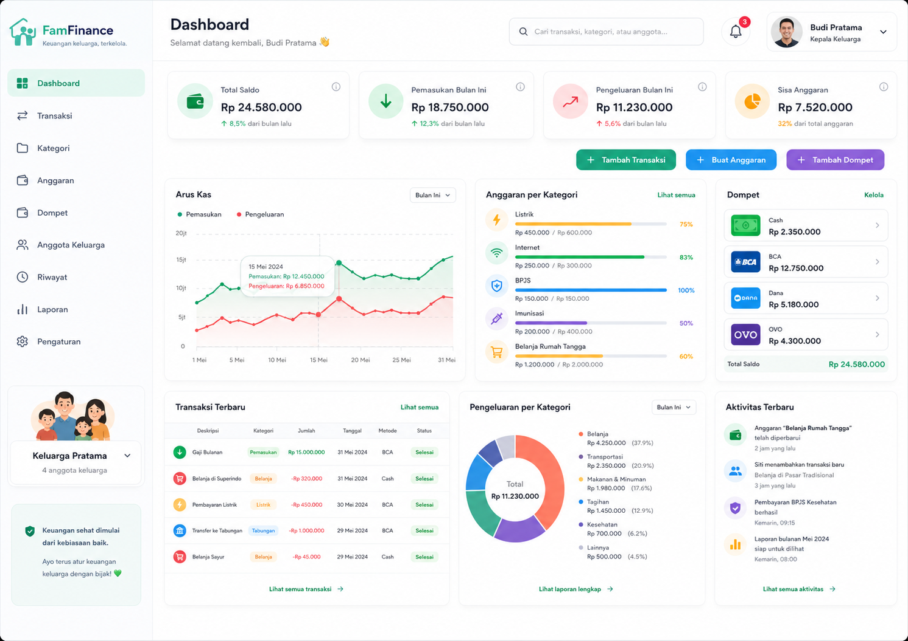

# FamFinance

FamFinance adalah aplikasi pencatatan keuangan keluarga berbasis Laravel 13, Blade, Tailwind CSS, Alpine.js, Chart.js, Vite, dan MariaDB.



## Kebutuhan sistem

Panduan ini ditujukan untuk Windows 10/11 64-bit dengan PowerShell 5.1 atau lebih baru.

| Komponen | Minimum project | Rekomendasi |
| --- | --- | --- |
| PHP | 8.3 | PHP 8.5 x64 |
| Composer | 2.x | Versi stabil terbaru |
| MariaDB | Kompatibel MySQL/MariaDB | MariaDB 11.8 LTS |
| Node.js | 22.12 | Node.js 24 LTS |
| npm | Mengikuti Node.js | Versi bawaan Node.js |

Node.js 20.19 secara teknis masih didukung oleh Vite 7, tetapi sudah EOL. Karena itu, setup baru sebaiknya memakai Node.js 24 LTS.

## Setup cepat

Jika FlyEnv, PHP, Composer, MariaDB, Node.js, dan npm sudah tersedia:

```powershell
git clone https://github.com/zidanm120303/family-finance.git
cd family-finance

Set-ExecutionPolicy -Scope Process Bypass
.\scripts\setup.ps1 -ConfigureDatabase -Seed
.\scripts\dev.ps1
```

Script akan meminta password administrator MariaDB dan password user aplikasi secara tersembunyi. Password hanya ditulis ke `.env` lokal yang diabaikan Git. Buka <http://127.0.0.1:8000> setelah seluruh service aktif. Hentikan development server dengan `Ctrl+C`.

> **Perhatian:** opsi `-Seed` mengisi data demo dengan cara mengosongkan tabel aplikasi terlebih dahulu. Gunakan hanya pada instalasi baru atau database development yang boleh di-reset.

## 1. Instal FlyEnv

### Otomatis dengan script

Buka PowerShell sebagai Administrator, masuk ke folder project, lalu jalankan:

```powershell
Set-ExecutionPolicy -Scope Process Bypass
.\scripts\install-flyenv.ps1
```

Script menggunakan Windows Package Manager (`winget`) untuk memasang FlyEnv dan kemudian membukanya.

### Manual

Unduh installer Windows dari [rilis resmi FlyEnv](https://github.com/xpf0000/FlyEnv/releases/latest), pasang, lalu jalankan FlyEnv. Saat pertama dibuka, izinkan pemasangan FlyEnv Helper. Jika helper gagal terpasang, jalankan FlyEnv sebagai Administrator satu kali.

## 2. Instal runtime di FlyEnv

FlyEnv memasang runtime melalui antarmuka grafis:

1. Buka modul **PHP** → **Versions** → pasang PHP 8.5 x64.
2. Aktifkan PHP tersebut dan pastikan extension berikut aktif:
   `ctype`, `curl`, `dom`, `fileinfo`, `filter`, `hash`, `mbstring`,
   `openssl`, `pdo`, `pdo_mysql`, `session`, `tokenizer`, dan `xml`.
3. Buka modul **Composer** → pasang Composer 2 versi stabil.
4. Buka modul **MariaDB** → pasang MariaDB 11.8 LTS → klik **Start**.
5. Buka modul **Node.js** → pasang Node.js 24 LTS. npm ikut terpasang bersama Node.js.
6. Pada setiap modul, gunakan **Set to System Path** untuk PHP, Composer, MariaDB, dan Node.js.
7. Tutup semua PowerShell/terminal dan buka kembali agar `PATH` terbaru dibaca.

FlyEnv juga mendukung versi yang lebih baru. Gunakan versi stabil/LTS selama masih memenuhi batas minimum project.

## 3. Verifikasi instalasi

Jalankan:

```powershell
php --version
composer --version
mariadb --version
node --version
npm --version
php -m
```

Pastikan `php -m` menampilkan `pdo_mysql`. Periksa executable yang sedang dipakai jika komputer pernah memiliki XAMPP, Laragon, atau NVM:

```powershell
where.exe php
where.exe composer
where.exe mariadb
where.exe node
where.exe npm
```

Path FlyEnv harus berada sebelum instalasi lama. Jika belum, atur ulang melalui **Set to System Path**, lalu buka terminal baru.

## 4. Ambil source code

```powershell
git clone https://github.com/zidanm120303/family-finance.git
cd family-finance
```

Laravel tidak perlu dipasang secara global untuk menjalankan repository ini. Perintah `composer install` akan memasang Laravel 13 sesuai `composer.lock`.

## 5. Siapkan MariaDB

Pastikan service MariaDB di FlyEnv berstatus **Running** dan port `3306` tidak digunakan MySQL/XAMPP lain.

### Pilihan A — dibuat oleh script

```powershell
Set-ExecutionPolicy -Scope Process Bypass
.\scripts\setup.ps1 -ConfigureDatabase -Seed
```

Nilai default yang dibuat:

- database: `family_finance`
- user aplikasi: `famfinance_app`
- akses: hanya dari komputer lokal

Script tidak menyimpan password administrator. Jika password user aplikasi dikosongkan saat ditanya, script membuat password acak dan menyimpannya hanya di `.env`.

### Pilihan B — dibuat manual

Di FlyEnv, buka **MariaDB** → **Manage** → **Create Database**. Buat database serta user khusus aplikasi. Jangan memakai user `root` sebagai user aplikasi.

Contoh SQL berikut hanya memakai placeholder:

```sql
CREATE DATABASE family_finance
    CHARACTER SET utf8mb4
    COLLATE utf8mb4_unicode_ci;

CREATE USER 'famfinance_app'@'127.0.0.1'
    IDENTIFIED BY '<GANTI_DENGAN_PASSWORD_LOKAL>';

GRANT ALL PRIVILEGES ON family_finance.*
    TO 'famfinance_app'@'127.0.0.1';
```

Salin file environment:

```powershell
Copy-Item .env.example .env
```

Kemudian ubah hanya `.env` lokal:

```dotenv
DB_CONNECTION=mysql
DB_HOST=127.0.0.1
DB_PORT=3306
DB_DATABASE=family_finance
DB_USERNAME=famfinance_app
DB_PASSWORD="<GANTI_DENGAN_PASSWORD_LOKAL>"
```

Jangan menaruh credential asli di `.env.example`, README, commit, issue, atau screenshot.

## 6. Instal dependency project

Cara yang disarankan:

```powershell
Set-ExecutionPolicy -Scope Process Bypass
.\scripts\setup.ps1 -Seed
```

Hilangkan `-Seed` jika database sudah berisi data yang ingin dipertahankan.

Tanpa script, urutan manualnya:

```powershell
composer install
Copy-Item .env.example .env
php artisan key:generate
php artisan config:clear
php artisan migrate --seed
npm ci
npm run build
php artisan test
```

Jangan jalankan `Copy-Item` lagi jika `.env` sudah berisi konfigurasi lokal.

## 7. Jalankan aplikasi

### Development server

```powershell
.\scripts\dev.ps1
```

Script memeriksa koneksi database, lalu menjalankan server Laravel, queue listener, log viewer, dan Vite melalui `composer run dev`.

URL aplikasi: <http://127.0.0.1:8000>

### Domain lokal FlyEnv

Untuk memakai `https://famfinance.test`:

1. Buka **Host** → **Add Site**.
2. Isi domain `famfinance.test`.
3. Arahkan **Root Path** ke folder `public`, bukan root project.
4. Pilih PHP yang memenuhi requirement project.
5. Pilih template URL rewrite **Laravel** jika memakai Nginx.
6. Aktifkan Auto SSL bila diperlukan.
7. Jalankan web server, PHP, dan MariaDB dari FlyEnv.
8. Ubah `APP_URL=https://famfinance.test` hanya di `.env` lokal.
9. Jalankan `npm run dev` untuk hot reload, atau `npm run build` untuk asset statis.

Mengarahkannya ke folder `public` penting agar `.env` dan file internal Laravel tidak dapat diakses melalui web.

## Perintah sehari-hari

```powershell
# Menjalankan development stack
.\scripts\dev.ps1

# Build frontend
npm run build

# Menjalankan test
php artisan test

# Status migration
php artisan migrate:status

# Menambah migration baru
php artisan migrate

# Membersihkan cache setelah mengubah .env
php artisan optimize:clear
```

## Troubleshooting

### `SQLSTATE[HY000] [2002] Connection refused`

- Jalankan MariaDB dari FlyEnv.
- Pastikan `DB_HOST=127.0.0.1` dan port sesuai.
- Cari konflik port:

```powershell
Get-NetTCPConnection -LocalPort 3306 -State Listen
```

### `Access denied for user`

- Cocokkan user, password, dan host di `.env`.
- Buat user aplikasi untuk host `127.0.0.1`.
- Gunakan menu **Reset Root Password** di FlyEnv hanya untuk memulihkan akun administrator.

### `could not find driver`

Aktifkan extension `pdo_mysql` pada `php.ini` milik PHP FlyEnv, restart PHP/web server, lalu verifikasi:

```powershell
php --ini
php -m | Select-String pdo_mysql
```

### `Vite manifest not found`

```powershell
npm ci
npm run build
```

### `npm` atau `php` memakai versi yang salah

Gunakan `where.exe` untuk menemukan duplikasi. Nonaktifkan PATH milik XAMPP/Laragon/NVM lama atau tempatkan PATH FlyEnv lebih dahulu.

### Script PowerShell diblokir

Izinkan script hanya untuk proses terminal saat ini:

```powershell
Set-ExecutionPolicy -Scope Process Bypass
```

## Keamanan Git dan GitHub

File `.env`, `vendor`, `node_modules`, build lokal, dan credential Wrangler sudah tercantum di `.gitignore`.

Sebelum push:

```powershell
git check-ignore .env
git status
git diff --cached
git add README.md .env.example scripts
git commit -m "docs: add complete FlyEnv setup guide"
git push origin main
```

Jika `.env` pernah terlanjur masuk Git, jangan hanya menghapus filenya. Rotasi seluruh credential yang terekspos dan bersihkan riwayat repository.

## Referensi resmi

- [FlyEnv Quick Start](https://docs.flyenv.com/guide/getting-started.html)
- [Menjalankan Laravel dengan FlyEnv](https://docs.flyenv.com/guide/run-laravel-use-flyenv.html)
- [Manajemen user database FlyEnv](https://docs.flyenv.com/guide/database-user-password.html)
- [Instalasi Laravel 13](https://laravel.com/docs/13.x/installation)
- [Persyaratan Node.js untuk Vite](https://vite.dev/guide/)
- [Jadwal rilis Node.js](https://nodejs.org/en/about/previous-releases)
- [MariaDB Community Server releases](https://mariadb.com/docs/release-notes/community-server)
